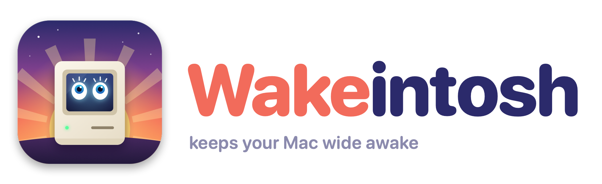

<p align="center">
  <picture>
    <source media="(prefers-color-scheme: dark)" srcset="assets/logo-dark.png">
    
  </picture>
</p>

<p align="center">
  A tiny menu bar app that keeps your Mac wide awake — forever, or for as long as you choose.
</p>

<p align="center">
  <a href="https://github.com/RishikeshSreekumar/wakeintosh/releases/latest"></a>
  
  
  <a href="LICENSE"></a>
</p>

---

## Features

- **One click to stay awake.** Stops your Mac, display and disk from sleeping, like `caffeinate -dimsu`.
- **Sleep timer.** Keep awake for 15 min, 30 min, 1, 2, 4 or 8 hours, or any custom number of minutes. A live countdown shows in the menu bar, and your Mac goes back to normal when it hits zero.
- **Allow Display to Sleep.** Let the screen turn off while the Mac keeps working (great for downloads and long builds).
- **Open at Login.** On by default, one click to turn off.
- **Safe by design.** If Wakeintosh quits or crashes, your Mac goes back to sleeping normally.
- **Lightweight.** Lives in the menu bar only. No Dock icon, no windows, no background services.

## Install

### Homebrew (recommended)

```sh
brew install --cask rishikeshsreekumar/tap/wakeintosh
```

Then open **Wakeintosh** from Applications or Spotlight. Look for the icon in your menu bar.

Update with `brew upgrade --cask wakeintosh`.

### Download

1. Download **Wakeintosh-x.y.dmg** from the [latest release](https://github.com/RishikeshSreekumar/wakeintosh/releases/latest).
2. Open it and drag **Wakeintosh** onto **Applications**.
3. Open Wakeintosh from Applications.

> **"Wakeintosh can't be opened" / "Apple could not verify…"?**
> Wakeintosh isn't signed with a paid Apple Developer certificate yet, so macOS asks you to confirm the first time. Pick one:
>
> - Open **System Settings → Privacy & Security**, scroll down and click **Open Anyway** next to Wakeintosh. Then open it again.
> - Or run this once in Terminal:
>   ```sh
>   xattr -dr com.apple.quarantine /Applications/Wakeintosh.app
>   ```
>
> Homebrew installs handle this for you.

### Build from source

Needs the Xcode Command Line Tools (`xcode-select --install`).

```sh
git clone https://github.com/RishikeshSreekumar/wakeintosh.git
cd wakeintosh
./build.sh --install
```

## Using it

Click the Wakeintosh icon in the menu bar:

| Menu item | What it does |
|---|---|
| **Keep Awake For → Indefinitely** | Stay awake until you turn it off |
| **Keep Awake For → 15 Minutes … 8 Hours** | Stay awake, then turn off automatically |
| **Keep Awake For → Custom…** | Enter any number of minutes |
| **Turn Off** | Let your Mac sleep normally again |
| **Allow Display to Sleep** | Screen may turn off; the Mac itself stays awake |
| **Open at Login** | Start Wakeintosh when you log in |

The icon is **in colour** while your Mac is being kept awake and **grey** when it's off. When a timer is running, the time left shows next to it.

## Uninstall

```sh
brew uninstall --cask wakeintosh          # add --zap to also remove settings
```

Or quit Wakeintosh from its menu and move it from Applications to the Bin.

## How it works

Wakeintosh runs macOS's built-in [`caffeinate`](https://ss64.com/mac/caffeinate.html) tool:

```
caffeinate -dimsu -w <wakeintosh pid> [-t <seconds>]
```

- `-d -i -m -s -u` prevent display, idle, disk and system sleep, and mark the user as active. With **Allow Display to Sleep** on, `-d` is dropped.
- `-w` ties `caffeinate` to the app, so it stops if Wakeintosh quits or crashes.
- `-t` is the sleep timer.

## Development

```sh
./build.sh                # build Wakeintosh.app (universal binary)
./build.sh --install      # build, copy to /Applications and relaunch
swift assets/make_art.swift assets   # regenerate icon + logos
VERSION=1.1 ./release.sh  # package, publish GitHub release, update Homebrew tap
```

The whole app is one file: [`main.swift`](main.swift). The icon and logo are drawn in code by [`assets/make_art.swift`](assets/make_art.swift).

## License

[MIT](LICENSE)
